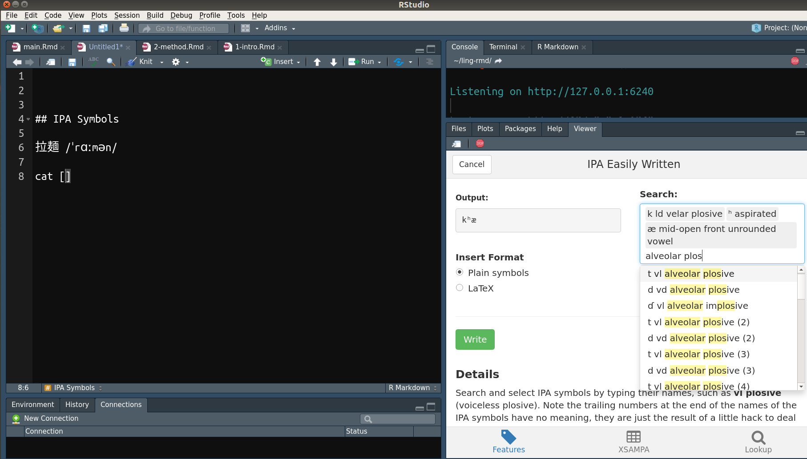

--- 
title: '臺大論文模板'
author: '廖永賦'
github-repo: "liao961120/ntuthesis"
date: "`r format(Sys.Date(), '%B %e, %Y')`" # Gitbook Date
site: bookdown::bookdown_site
## Opts above are for gitbook output; below are for PDF output
two-side: false  # Whether to start new chapter on odd pages
#secnumdepth: 2   # section numbering at most to x.y.z
indent: false    # Indent new paragraph, else adds space between paragraphs 
linestretch: 1.5   # If Chinese: 1.5
linestretch-code: 1  # linestretch for code chunks
watermark: watermark.png    # ntu watermark file (must be in root dir)
link-citations: yes         # internal links to references
bibliography: ref.bib
## Shouldn't touch things below unless familiar with R Markdown
#biblio-style: apa #authoryear
#biblatexoptions: [backend = biber, style = caspervector, utf8, sorting = cenyt]
#biblio-title: "biblatex 參考文獻"
links-as-notes: true
always_allow_html: yes
geometry: a4paper, left=1.18in, right=1.18in, top=1.18in, bottom=0.787in
subparagraph: yes
acknowledgements-title: '誌謝'
acknowledgements: |
  `r paste(readLines("_acknowledge.Rmd", encoding = "UTF-8"), collapse = "\n  ")`
abstract-zh: |
  `r x=readLines("_abstract-zh.Rmd", encoding = "UTF-8"); paste(x, collapse = "\n  ")`
abstract-en: |
  `r x=readLines("_abstract-en.Rmd", encoding = "UTF-8"); paste(x, collapse = "\n  ")`
---


`r if(knitr::is_html_output()) '
# 關於 {- #about}\n

這是 [ntuthesis](https://liao961120.github.io/ntuthesis) 的說明文件。這份說明文件是以臺大論文格式所寫成，並且可以輸出成 HTML（GitBook），亦即您目前所見的文件，或是 PDF，亦即完整的臺大論文（可透過 navbar 上的 <i class="fa fa-file-pdf-o"></i> 查看）。\n
\n
使用此論文模板應至少對 R Markdown 有初步的了解，例如知道 Markdown 的基本語法並且曾透過 R Markdown 輸出 html_document。
'`

<!-- 
Below are code that paste acknowledgement and abstract in GitBook output. 
Remove or wrap them around HTML comments if don't want to display them in GitBook.
-->

<!-- Acknowledgement -->
<!-- `r if(knitr::is_html_output()) '# 誌謝 {- #acknowledge}\n'` -->

<!-- `r if (knitr::is_html_output()) paste(readLines("_acknowledge.Rmd", encoding = "UTF-8"), collapse = "\n  ")` -->

<!-- Abstract -->
<!-- `r if(knitr::is_html_output()) '# 摘要 {- #abstract}\n'` -->

<!-- `r if (knitr::is_html_output()) paste(readLines("_abstract-zh.Rmd", encoding = "UTF-8")[5:length(readLines("_abstract-zh.Rmd", encoding = "UTF-8"))], collapse = '\n')` -->

<!-- keywords -->
<!-- `r if (knitr::is_html_output()) '<br><br>'` -->

<!-- `r if (knitr::is_html_output()) paste('**keywords:**', readLines("_abstract-zh.Rmd", encoding = "UTF-8")[2])` -->


```{r setup, include=FALSE}
knitr::opts_knit$set(root.dir='R')
#knitr::opts_chunk$set(fig.pos = 'H')
options(digits = 2) # round values of vars to 2 digits when printed
knitr::opts_chunk$set(
    #echo = FALSE,  # echo = FALSE hides themorem environment
    message = FALSE,
    warning = FALSE,
    comment="",
    fig.align = 'center',
    out.width = "100%"
    #fig.dim = c(3.5, 3.5)  # (width, height)
)
```


<!--chapter:end:index.Rmd-->


# 安裝 {#install} 

Placeholder


### `v1.0.0` {-}
### 最新版 {-}
## IDE
## LaTeX
### tinytex 套件
#### LaTeX 套件管理 {#tinytex-manage}
##### Mac {#mac}

<!--chapter:end:01-1-install.Rmd-->


# 輸出論文 {#export-thesis}

Placeholder


## 匯入論文模板 {#import-template}
## 編輯封面 {#edit-front-matter}
## Compile 論文 {#compile-thesis}

<!--chapter:end:01-2-compile.Rmd-->


# 論文撰寫 {#write-thesis}

Placeholder


## 檔案結構 {#dir-structure}
## `index.Rmd` {#index-rmd}
## 撰寫語言 {#write-lang}
### `_output.yml`
### `_bookdown.yml`
## 文獻引用 {#bib-cite}
### `ref.bib` {#ref-bib}
### 引用語法 {#cite-syntax}
### 書目管理軟體 {#ref-manager}
### 多語言文獻引用 {#multi-lang-cite}

<!--chapter:end:02-write-thesis.Rmd-->


# 語法 Cheatsheet {#cheatsheet}

Placeholder


## 章節連結 {#chapter-cross-ref}
### 錨點定義 {#define-anchor}
### 內文連結
## 數學 {#math}
### Unnumbered Equations
### Numbered Equations
### Multi-line Aligned Equations
### 定理與證明 {#theorem-proof}
### 環境 {#environment}
## Figure Referencing
### Figure Caption
## Table Referencing
### Link Table in Later Sections {-}
## 總整理

<!--chapter:end:03-bookdown-demo.Rmd-->

```{r echo=FALSE, include=TRUE}
klippy::klippy(position = c('top', 'right'),
               all_precode = TRUE)
```

# 進階功能擴充 {#add-on}

透過其它 R 套件，R Markdown 的撰寫過程能夠更順暢。以下介紹幾個例子，歡迎補充說明。


## 語言學 {#ling}

語言學相關文件寫作時，常需要插入 IPA 語音符號，但鍵盤通常難以直接打出這些符號。為此，我寫了一個 R 套件，讓使用者能直接在 RStudio 中透過輸入語音 features 的方式打出 IPA：

```{r echo=FALSE, fig.cap="使用 linguisticsdown 套件插入 IPA 音標符號"}
if (knitr::is_html_output()) {
  knitr::include_graphics("https://liao961120.github.io/linguisticsdown/man/figs/features.gif")
} else {
  
  }
```
<br>

要使用這功能，需安裝 `linguisticsdown`：
```r
install.packages("linguisticsdown")
```

關於更詳細的功能，見[套件網頁](https://liao961120.github.io/linguisticsdown/)

<!--chapter:end:04-specific-extension.Rmd-->

# 問題協助 {- #feed-back}


## 提出問題 {- #issue}

若使用此模板遇到困難不知如何解決，可以透過下列管道聯絡我（按優先順序排列）：

1. 提出 [GitHub issue](https://github.com/liao961120/ntuthesis/issues)（需有 GitHub 帳號）
1. 直接在這份說明文件中**與問題相關的章節**留言（頁面最下方的 disqus 留言）
1. 除非有特殊的原因，**請勿透過電子郵件提出問題**。公開自己的問題對其他人有很大的幫助，也能避免將時間浪費在重複回答相同的問題。


## R Markdown 相關資源 {- #rmd-resources}

以下都是 R Markdown 相關的參考資源。與此論文模板最直接相關的是 *Bookdown*。*R Markdown: The Definitive Guide* 幾乎涵蓋了 R Markdown 的所有用途（例如，投影片製作）。Pandoc 則是 R Markdown 能夠支援多種輸出格式的關鍵，因為 R Markdown 的格式輸出是仰賴 Pandoc 模板（也是這個論文模板的製作方式）且 R Markdown 的 Markdown 語法即是 Pandoc Markdown 的語法。

- [Bookdown](https://bookdown.org/yihui/bookdown)

- [R Markdown: The Definitive Guide](https://bookdown.org/yihui/rmarkdown)

- [Pandoc User’s Guide](http://pandoc.org/MANUAL.html)


## Improve the Project {-}

最後，若您發現這份論文模板有錯誤或是可以改進的地方，同樣可以依上述的[步驟](#issue)提出問題。甚至如果知道如何解決問題，歡迎直接提出 pull request。pull request 的範圍不限在模板本身。若您看到這份文件中有任何錯誤，可以直接透過 navbar 上的 <i class="fa fa-edit"></i> 修改文件。

<!--chapter:end:50-feedback.Rmd-->

# (APPENDIX) 附錄 {-}

# 尋找 LaTeX 高手 {#latex-cite-pkg}

R Markdown 的 PDF 輸出是透過 Pandoc 的 LaTeX 模板，因此理論上 LaTeX 可以做到的事，也可以透過 R Markdown 達成。目前的問題是

> LaTeX 本身並未有支援繁體中文格式的文獻引用套件

經過一段時間的搜尋，發現 biblatex 套件似乎可以定義不同的引用格式[^biblatex] [^biblatex2]，因此，或許可以透過定義新的標點符號，例如將原本引用格式中

- `,` 定義成 `，`
- `.` 定義成 `。`

再透過 `.bib` 檔中的 `langid` field 辨識要使用何種引用格式。然而，由於作者本人對 LaTeX 並不熟悉，因此需要這方面熟手的協助。


[^biblatex]: https://tex.stackexchange.com/questions/417762/different-styles-between-citations-and-bibliography

[^biblatex2]: https://tex.stackexchange.com/questions/377308/different-citation-styles-for-the-same-bibliography

<!--chapter:end:80-appx-help.Rmd-->

# 後記 {#epilogue}

> I have a dream that one day all students and researchers will forget what "formatting a paper" even means. I have a dream that one day journals and grad schools no longer have style guides. I have a dream that one day no missing \$ is inserted, and \\hbox is never overfull.
>
> \hspace*{\fill} --- [Yihui Xie](https://twitter.com/xieyihui/status/1022873179532996609)


<br>

R Markdown 的精神之一就是希望能免除使用者排版的困擾。在認識 R Markdown 的第一天後，我就希望未來（如果有機會的話）可以用 R Markdown 寫論文。但從第一次嘗試用 R Markdown 輸出中文 PDF 時，我就意識到這是一件麻煩事[^fck-latex]。換句話說，應該等不到有人幫我做出論文模板的一天。因此，自己就站在前輩們的肩膀上[^base]，做出了這個論文模板。

[^base]: 包含 tzhuan/ntu-thesis (https://github.com/tzhuan/ntu-thesis) 的 XeLaTeX 台大論文模板、thesisdown (https://github.com/ismayc/thesisdown) 的啟發、Pandoc 以及 Bookdown 和 R Markdown 的生態系統。

[^fck-latex]: 這一切都起源於 LaTeX 的複雜度。

<!--chapter:end:82-appx-epilogue.Rmd-->

\renewcommand{\href}{\oldhref}

# 參考資料 {- #references}

<!--chapter:end:90-references.Rmd-->

